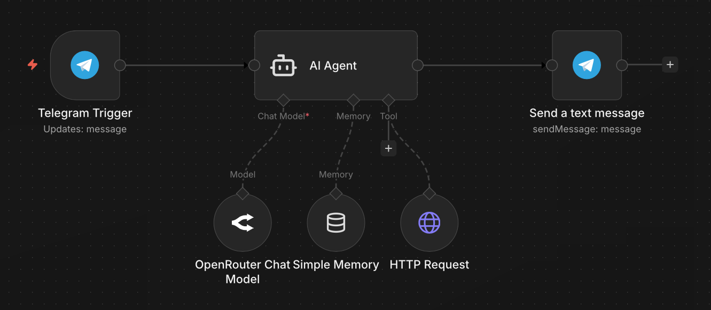

# AI News Agent (n8n Workflow)

This n8n workflow implements a Telegram bot capable of functioning as an intelligent news assistant. It leverages LangChain and OpenRouter to interpret natural language, manage conversation memory, and dynamically query the News API service based on user intent.

While I typically architect AI agents programmatically using Python, this project explores low-code orchestration as a means for rapid prototyping.



## System Overview

The workflow integrates several key components to deliver real-time news summaries:

* **LangChain AI Agent:** Orchestrates the logic using an OpenRouter LLM model. It determines when to utilize external tools based on the user's prompt.
* **News API Integration:** A custom HTTP Request tool configured to fetch headlines using inferred parameters (Category and Keywords).
* **Conversation Memory:** Utilizes a Window Buffer to maintain context throughout the chat session.
* **Data Sanitization:** A JavaScript-based regex transformation ensures all output adheres to Telegram's strict MarkdownV2 escaping requirements to prevent API errors.

## Prerequisites

To deploy this workflow, you will need:

1. **n8n Instance:** Self-hosted or Cloud version.
2. **Telegram Bot Token:** Generated via @BotFather.
3. **OpenRouter API Key:** For access to the LLM.
4. **NewsAPI.org API Key:** Required for the HTTP Request tool.

## Installation and Configuration

1. **Import Workflow:** Download the `news_agent.json` file and import it into your n8n editor.
2. **Setup Credentials:** Configure the following credential nodes within n8n:
   - `Telegram API`
   - `OpenRouter API`
   - `Header Auth` (for News API)
3. **Activate:** Switch the workflow status to **Active**.

## Logic Description

The workflow operates in the following sequence:

1. **Ingestion:** The Telegram trigger node receives a message.
2. **Processing:** The AI agent processes the text alongside the simple memory buffer.
3. **Tool Execution:** If the user asks for news (e.g., "latest tech news"), the agent triggers the HTTP request tool.
4. **Formatting:** The output is passed to the final Telegram node. A dynamic expression applies regex replacement to escape reserved characters (such as `.`, `-`, `!`) required for `MarkdownV2` parsing:
   ```javascript
   {{ $json.output.replace(/\./g, '\\.').replace(/-/g, '\\-').replace(/!/g, '\\!') }}
5. **Delivery:** The sanitized response is sent back to the user via Telegram.

## Usage

Once active, users can interact with the bot using natural language.

**Example Query:**

> "Find me the latest headlines regarding Artificial Intelligence"

The bot will parse "business" as the category and "Artificial Intelligence" as the query term, fetch the data, and return a summarized response.